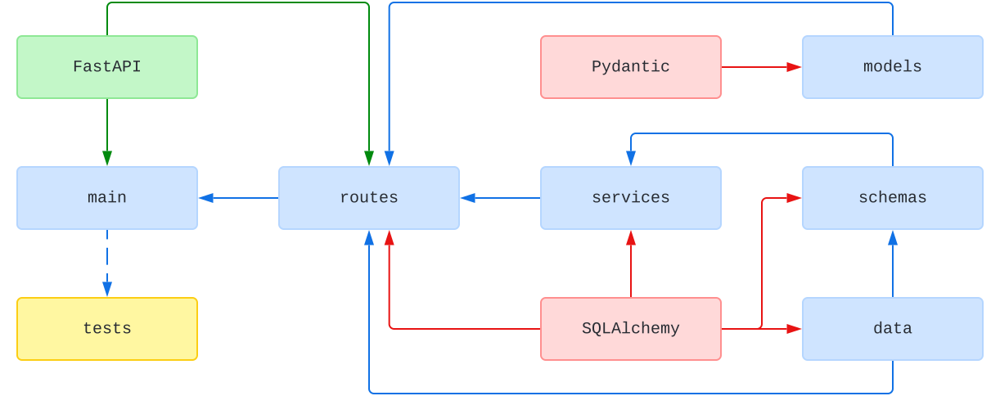

# 🧪 RESTful API with Python 3 and FastAPI - 脆弱コード

これで主要な脆弱性を導入しました：

SQLインジェクション脆弱性:
生のSQLクエリを使用
パラメータのバインドなし
文字列連結によるクエリ構築
XSS脆弱性:
HTMLレスポンスでのエスケープ処理なし
ユーザー入力の直接出力
データベースセキュリティの問題:
接続プールの制限なし
タイムアウトなし
トランザクション分離レベルなし
セッション管理の不備
入力バリデーションの脆弱化:
型チェックの緩和
バリデーションの削除

これらの変更により、以下のような攻撃が可能になります：

SQLインジェクション: squad_number=1 OR 1=1; DROP TABLE players;--
XSS: first_name=<script>alert('XSS')</script>
リソース枯渇: 無制限の接続プール
データ整合性の破壊: トランザクション分離レベルなし

## About

Proof of Concept for a RESTful API made with [Python 3](https://www.python.org/) and [FastAPI](https://fastapi.tiangolo.com/).

## Structure

The following is a simplified dependency diagram of modules and main libraries:



## Install

```console
pip install --requirement requirements.txt
```

## Start

```console
uvicorn main:app --reload --port 9000
```

## Documentation

```console
http://localhost:9000/docs
```


