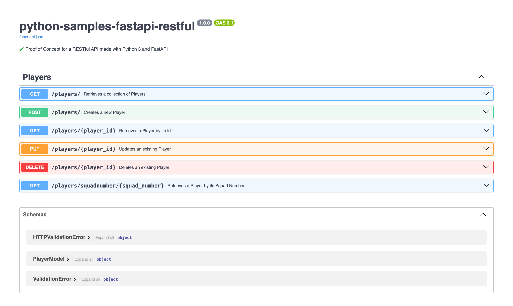

# 🧪 RESTful API with Python 3 and FastAPI

## About

Proof of Concept for a RESTful API made with [Python 3](https://www.python.org/) and [FastAPI](https://fastapi.tiangolo.com/).

## Structure

The following is a simplified dependency diagram of modules and main libraries:


## Install

```console
pip install --requirement requirements.txt
```

## Start

```console
uvicorn main:app --reload --port 9000
```

## Documentation

```console
http://localhost:9000/docs
```


